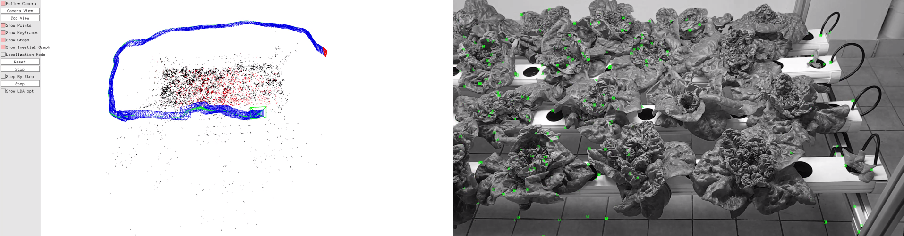

# Hexafarms' SLAM application for indoor farms

### Hexafarms figure out automated monitoring using SLAM

### Supports how to use custom dataset 

1. Calibrate your camera using [hexafarms' repo](https://github.com/HexaFarms/Cam_Calibration)
* Compose your configure file in ``` Examples/Monocular/Hexa.yaml ```
2. Generate a series of images from your custom video
```
sudo apt install ffmpeg
ffmpeg -i testvideo.mp4 frame%d.png
// in case, image resize: vf scale="640:-1" but intrinsic value should be changed.
``` 

3. Generate text files which generate compatible text file. 
```
python hexafarms/gen_txt_imgs.py
```
4. Run the script below

```
./Examples/Monocular/mono_tum Vocabulary/ORBvoc.txt Examples/Monocular/hexa.yaml ./hexafarms
```

[](https://www.youtube.com/watch?v=Nr5Vn0nZLp0 "SLAM in indoor farm")


# ORB-SLAM3

### V1.0, December 22th, 2021
**Authors:** Carlos Campos, Richard Elvira, Juan J. Gómez Rodríguez, [José M. M. Montiel](http://webdiis.unizar.es/~josemari/), [Juan D. Tardos](http://webdiis.unizar.es/~jdtardos/).

The [Changelog](https://github.com/UZ-SLAMLab/ORB_SLAM3/blob/master/Changelog.md) describes the features of each version.

ORB-SLAM3 is the first real-time SLAM library able to perform **Visual, Visual-Inertial and Multi-Map SLAM** with **monocular, stereo and RGB-D** cameras, using **pin-hole and fisheye** lens models. In all sensor configurations, ORB-SLAM3 is as robust as the best systems available in the literature, and significantly more accurate. 
